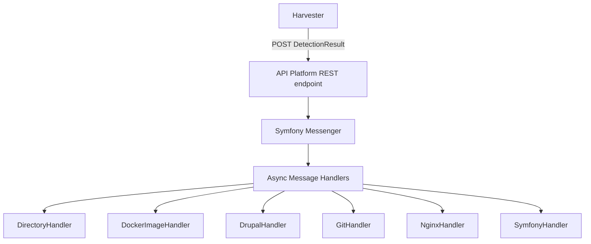

# itk-dev/devops_itksites — claude-md

**Why it's worth keeping:** Uses Mermaid diagrams to explain complex data flow; provides exact command snippets for a containerized environment to minimize LLM hallucination on CLI usage; defines strict coding conventions/rules.

**Summary:** A highly structured technical manual including Mermaid diagrams, exact Docker commands for development workflows, and specific architectural constraints.

**Source credibility:** Appears to be an internal professional-grade tool with high information density.

**Recency:** Extremely current, referencing bleeding-edge technologies like PHP 8.5 and Symfony 8.

**Source:** [itk-dev/devops_itksites/claude.md](https://github.com/itk-dev/devops_itksites/blob/28a6d276213ce007d31b8a7075f19afabfd55d68/claude.md) · 0★

<details><summary>Excerpt (first 1200 chars)</summary>

```markdown
# 🤖 Code Agents - DevOps ITKsites

## Project Overview

**DevOps ITKsites** is an internal Symfony application for server and site
registration/monitoring at ITK Dev. It receives `DetectionResults` from the
[ITK sites server harvester](https://github.com/itk-dev/devops_itkServerHarvest)
and processes them asynchronously to track servers, sites, domains, Docker
images, packages, modules, CVEs, and git repositories.

## Technology Stack

- **Language**: PHP 8.5+ (Symfony 8.0)
- **API**: API Platform 4.0 (REST)
- **Admin UI**: EasyAdmin 5.x
- **Database**: Doctrine ORM 3.x / DBAL 4.x with MariaDB
- **Messaging**: Symfony Messenger (AMQP/RabbitMQ)
- **Auth**: OpenID Connect (`itk-dev/openid-connect-bundle`)
- **Frontend**: Webpack Encore, Stimulus.js
- **Testing**: PHPUnit 13+
- **Code Quality**: PHP-CS-Fixer, PHPStan, Rector

## Architecture



</details>
