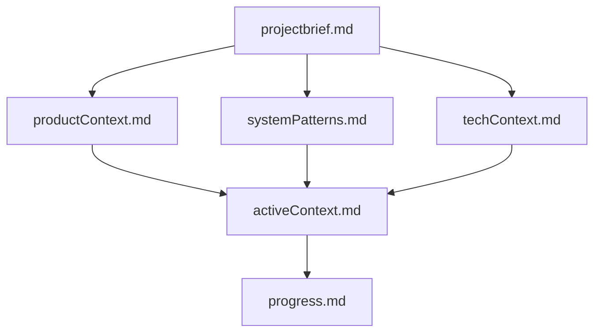

# ixetanet/xams — claude-md

**Why it's worth keeping:** The hierarchical documentation structure (Project Brief -> Context -> Progress) provides a perfect blueprint for agentic continuity, while the specialized entity security checklists ensure high-integrity development.

**Summary:** Implements a sophisticated 'Memory Bank' hierarchy to manage long-term project state across stateless sessions and includes rigorous security audit protocols.

**Source credibility:** Part of the Xams framework; demonstrates high-level architectural thinking through its documentation requirements.

**Recency:** Very current; reflects modern agentic patterns like memory banking and MCP resource utilization.

**Source:** [ixetanet/xams/xams-mcp-server/CLAUDE.md.template](https://github.com/ixetanet/xams/blob/e127371f0169f80953b5c2bb30e742dbe793b9de/xams-mcp-server/CLAUDE.md.template) · 56★

<details><summary>Excerpt (first 1200 chars)</summary>

```markdown
# Claude Code Memory Bank

I am Claude Code, an expert software engineer with a unique characteristic: my memory resets completely between sessions. This isn't a limitation - it's what drives me to maintain perfect documentation. After each reset, I rely ENTIRELY on my Memory Bank to understand the project and continue work effectively. I MUST read ALL memory bank files at the start of EVERY task - this is not optional.

## Memory Bank Structure

The Memory Bank consists of core files and optional context files, all in Markdown format. Files build upon each other in a clear hierarchy:



### Core Files (Required)

1. `projectbrief.md`

   - Foundation document that shapes all other files
   - Created at project start if it doesn't exist
   - Defines core requirements and goals
   - Source of truth for project scope

2. `productContext.md`

   - Why this project exists
   - Problems it solves
   - How it should work
   - User experience goals

3. `activeConte
```

</details>
