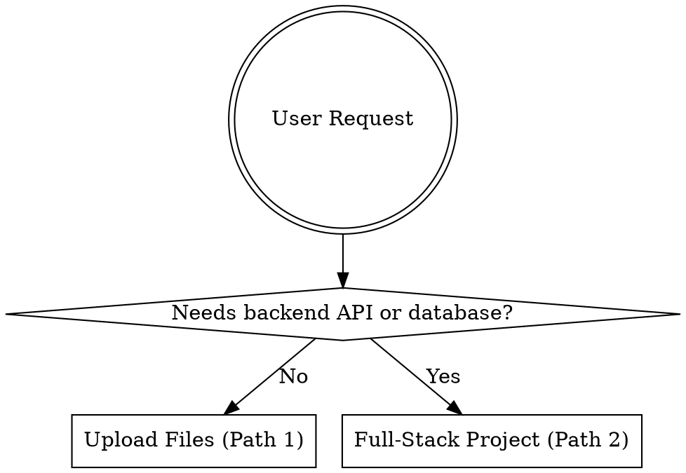

# glitternetwork/pinme — skill

**Why it's worth keeping:** The use of `dot` diagrams for logical branching is an elite technique, and providing explicit directory structures ensures the agent can navigate and modify files accurately.

**Summary:** Provides a complete deployment workflow for both static IPFS uploads and complex full-stack React/Cloudflare applications. It includes structured decision trees to guide the agent through specific user needs.

**Source credibility:** Highly credible with 3.6k+ stars and very active maintenance.

**Recency:** Extremely current; updated within the last month.

**Source:** [glitternetwork/pinme/skills/pinme/SKILL.md](https://github.com/glitternetwork/pinme/blob/41cc894527f83c0ddb4fc52f2a150952a59d0373/skills/pinme/SKILL.md) · 3669★

<details><summary>Excerpt (first 1200 chars)</summary>

```markdown
---
name: pinme
description: Use this skill when the user mentions "pinme", or needs to upload files, store to IPFS, create/publish/deploy websites or full-stack services (including frontend pages, backend APIs, database storage, email sending, etc.), or any feature requiring backend database/server support.
---

# PinMe

Zero-config deployment tool: upload static files to IPFS, or create and deploy full-stack web projects (React+Vite + Cloudflare Worker + D1 database). Workers also support sending emails via the PinMe platform API.

## When to Use



## Path 1: Upload Files / Static Sites

> Login required. Use `pinme login` or `pinme set-appkey <AppKey>` before `pinme upload` or `pinme import`.

```dot
digraph upload_flow {
    "Install/update pinm
```

</details>
